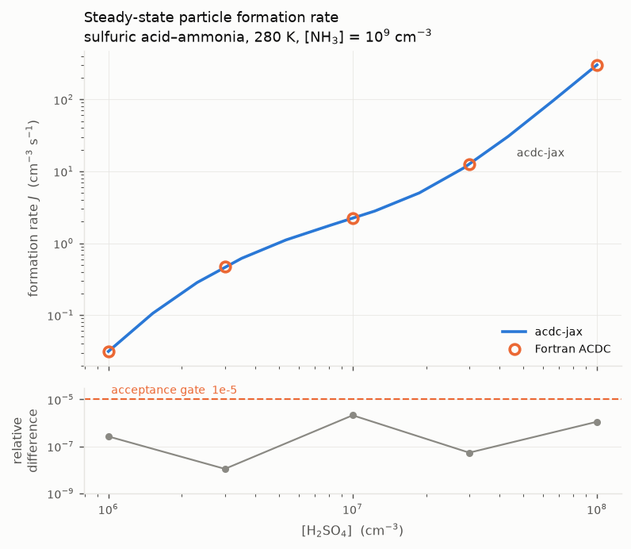
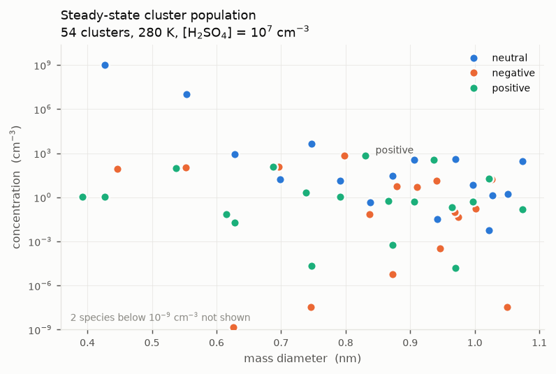
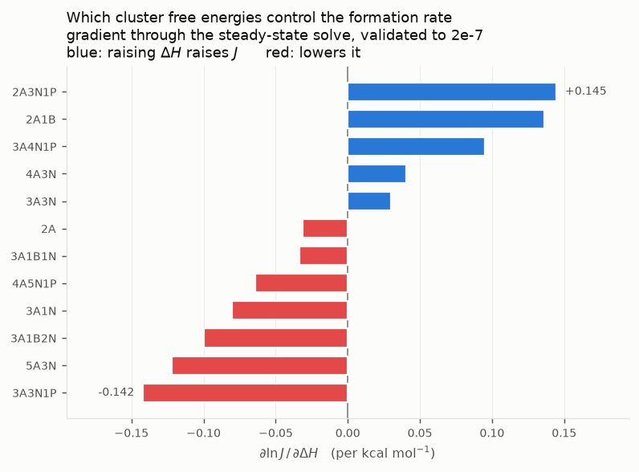
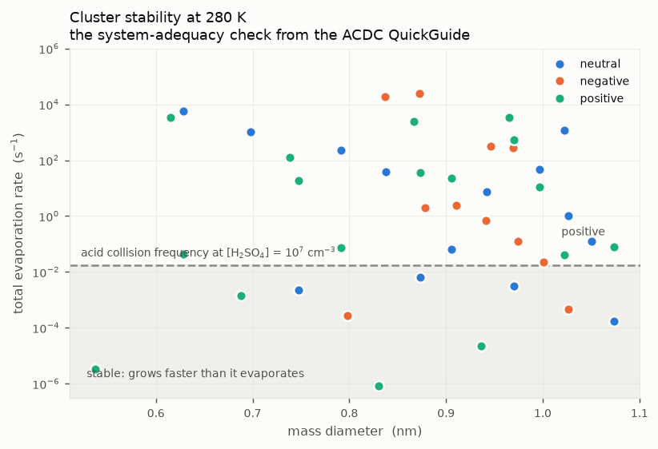
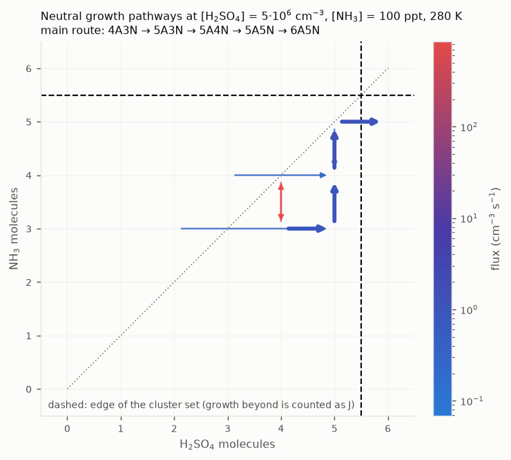
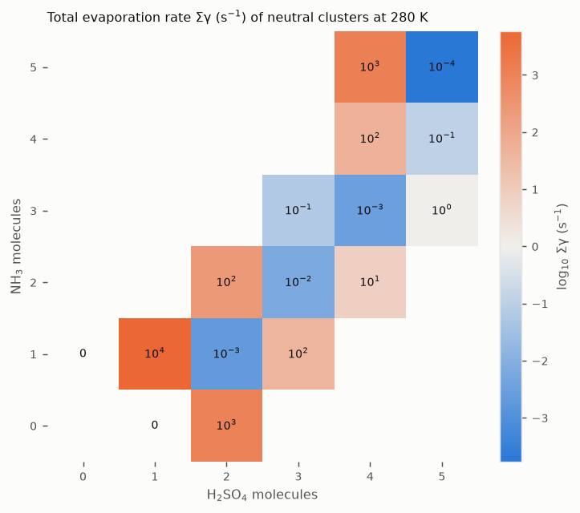

# acdc-jax

Differentiable atmospheric molecular-cluster dynamics in Python/JAX.
A faithful port of [ACDC](https://github.com/tolenius/ACDC) (Atmospheric
Cluster Dynamics Code; Kupiainen-Määttä & Olenius), validated against the
Fortran reference.

> **Status: Phases 0–10 complete.** Small-set and loop modes, every
> generator option, steady state by integration or root-find, `jax.grad`
> through the whole model, growth-pathway diagnostics. Gated against the
> Fortran at 1e-12 for rates and 1e-5 for *J*. See
> [`docs/plan/PROGRESS.md`](docs/plan/PROGRESS.md) for the per-slice record
> and [`docs/fidelity.md`](docs/fidelity.md) for every upstream quirk found.

## What ACDC does

ACDC models the very first step of new particle formation: gas-phase
molecules clustering into molecular clusters and on to ~1–2 nm particles. It
generates and solves the cluster birth–death equations for a given cluster
set and quantum-chemical thermodynamics, yielding cluster concentrations and
a particle formation rate *J*.

It is a **kinetic** model — it makes no assumptions about cluster
thermodynamics. Cluster free energies are input, typically from quantum
chemistry (see the [Atmospheric Cluster
Database](https://github.com/elmjonas/ACDB)).

## Why a JAX port

- **Gradients.** The dominant uncertainty in ACDC is the input cluster free
  energies. `jax.grad` makes ∂J/∂ΔG available, turning that uncertainty into
  an invertible problem rather than a sensitivity study run by hand.
- **Batching.** Steady-state *J* over a (vapour, T, CS, IPR) grid is
  embarrassingly parallel. `sensitivity.formation_rate_batch` runs the whole
  grid as one `vmap`-ed solve: 64 points take 5.3 s where the serial loop
  takes 49.2 s, and the batch is nearly flat in size. That is the practical
  way to build formation-rate lookup tables for large-scale models.
- **Cluster sets as data.** Upstream regenerates Fortran source with an
  11.7k-line Perl script for every cluster set. Here the `.inp` file,
  the ΔH/ΔS table and the dipole/polarizability table are parsed directly
  into arrays. No code generation, no recompilation.
- **Exact Jacobian.** Upstream ships an empty `jeval` and runs VODE with
  `mf=22`, i.e. a finite-difference Jacobian costing `neqn` extra RHS calls
  per build. `jax.jacfwd` of the traced RHS is exact and free.

## Install

```bash
uv sync --extra dev
uv run pytest
```

Python ≥3.11. JAX CPU by default; `--extra gpu` targets CUDA (untested —
development is on Apple silicon).

## Validation

The port is validated against the vendored Fortran at every level, not just
end-to-end. Thresholds are in [`docs/validation.md`](docs/validation.md):

| Gate | Threshold |
|---|---|
| Rate constants `K`, `E`, `cs` vs emitted literals | < 1e-12 rel |
| `dc/dt` vs f2py-wrapped `feval` | < 1e-12 rel |
| Steady-state *J* vs the Fortran binary | < 1e-5 rel |
| Root-find vs time-integration steady state | < 1e-8 rel |
| `jax.grad` vs central finite difference | < 1e-3 rel |
| Boundary-cascade decisions vs `--print_boundary` | exact match |

The last is exact rather than approximate because the boundary cascade is
combinatorial: it decides which out-of-set collision products are counted as
grown-out and which are stripped back into the system. Any divergence there
is a different model, not a rounding difference.

## Figures

Regenerate all of them from a clean checkout with
`uv run python scripts/make_figures.py`.

| | |
|---|---|
|  |  |
| **Parity.** Steady-state *J* against the Fortran reference, with the residual against the 1e-5 acceptance gate. | **Steady-state population.** All 54 clusters against mass diameter, split by charge. |
|  |  |
| **∂ln*J*/∂ΔH.** Which cluster free energies control the formation rate — the capability the reference cannot provide. | **Stability.** Evaporation against acid-collision frequency: the system-adequacy check from the ACDC QuickGuide. |
|  |  |
| **Growth pathway.** Significant fluxes between neutral clusters in composition space at the QuickGuide's conditions; the main route exits through 5A5N → 6A5N, as the QuickGuide finds. | **Evaporation map.** Total evaporation rate on the (acid, base) grid: the largest clusters must be cold for the set to be adequate. |

## Documentation

- [`docs/plan/ULTRAPLAN.md`](docs/plan/ULTRAPLAN.md) — the full arc
- [`docs/physics.md`](docs/physics.md) — the equations, with sources
- [`docs/fidelity.md`](docs/fidelity.md) — every deliberate divergence and
  upstream quirk, with the flag that controls it
- [`docs/porting-notes.md`](docs/porting-notes.md) — what changed and why
- [`docs/KEY_DECISIONS.md`](docs/KEY_DECISIONS.md) — ADR log

## Licence

GPL-3.0, inherited from ACDC. See [`COPYRIGHT.md`](COPYRIGHT.md) for what
that means for downstream integration, and [`PROVENANCE.md`](PROVENANCE.md)
for the vendored reference.
